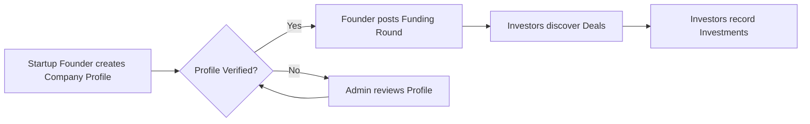
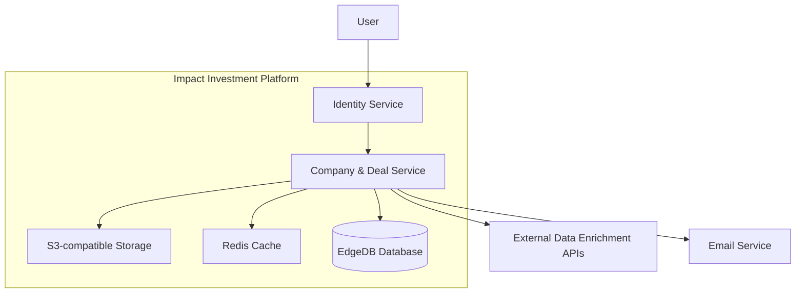
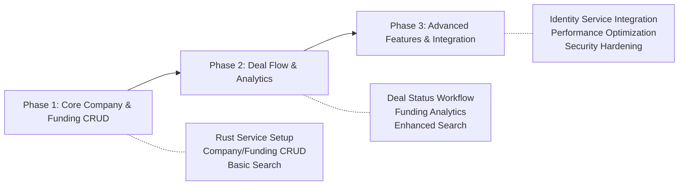

name: "Planning PRP - Company & Deal Management Service"
description: |
  Generate a comprehensive Product Requirements Document (PRD) for the Company & Deal Management Service,
  focusing on core entity management, deal flow, and integration with the Impact Investment Platform.

## Initial Concept
The Company & Deal Management Service (`companies`) will serve as the core business entity management layer for the Impact Investment Platform, managing startups, investment organizations, funding opportunities, and deal flow.

## Planning Process

### Phase 1: Idea Expansion & Research

#### Context Gathering
```yaml
research_areas:
  technical_research:
    - existing_solutions: "Review existing company/deal management systems for best practices."
    - libraries: "Rust (Axum, Tonic), EdgeDB, Redis, S3-compatible storage."
    - patterns: "gRPC for internal APIs, REST for file uploads, OpenTelemetry for monitoring."
  internal_context:
    - current_system: "Integrate with existing Identity service, EdgeDB companies, funding, ownership, impact modules."
    - constraints: "High availability (99.9%), low latency (sub-500ms for most ops), data accuracy (95%+)."
    - integration_points: "Identity service, external data enrichment APIs, Email Service."
```

#### Initial Exploration
```
RESEARCH similar solutions:
  - WEB_SEARCH: "Rust gRPC microservice examples"
  - WEB_SEARCH: "EdgeDB schema design for multi-tenant applications"
  - WEB_SEARCH: "Deal flow management system architecture"

ANALYZE existing codebase:
  - FIND: `../docs/SCHEMA.md` for existing EdgeDB schema design.
  - IDENTIFY: Patterns for service integration and data handling.
  - NOTE: Existing EdgeDB modules (`companies`, `funding`, `core`) are to be leveraged without changes in Phase 1.
```

### Phase 2: PRD Structure Generation

#### 1. Executive Summary
```markdown
## Problem Statement
Lack of a centralized, comprehensive system for managing business entities (startups, investment orgs) and their associated funding and deal flow activities within the Impact Investment Platform.

## Solution Overview
Develop a Rust-based Company & Deal Management Service using Axum and EdgeDB, providing robust APIs for company and funding round management, deal tracking, and analytics.

## Success Metrics
- Company profile completion rate > 80% within 7 days.
- Deal posting to active status < 24 hours.
- Service availability > 99.9% uptime.
```

#### 2. User Stories & Scenarios
```markdown
## Primary User Flow


## User Stories
1. **As a Startup Founder**, I want to create a comprehensive company profile so that investors can discover my company.
   - Acceptance Criteria: Company name uniqueness, logo upload, team member association.
2. **As an Investment Organization**, I want to manage my firm's profile and track deal flow so that I can efficiently source and manage investments.
   - Acceptance Criteria: Specialized fields for investment orgs, portfolio linkage.
```

#### 3. System Architecture
```markdown
## High-Level Architecture


## Component Breakdown
- **Backend Service**: Rust (Axum, Tonic) for Company & Funding management.
- **Database**: EdgeDB (leveraging `companies`, `funding`, ``ownership`, `impact` modules).
- **Caching**: Redis for frequently accessed data.
- **Storage**: S3-compatible for documents and media.
- **API**: gRPC (internal), REST (file uploads).

- **Data Models (Existing EdgeDB Schema - Phase 1)**:
  ```edgeql
  # Existing companies module
  module companies {
    type Company extending core::Timestamp {
      required name: str;
      tagline: str;
      mission: str;
      description: str;
      logo_url: str;
      # ... other fields ...
    }
  }

  # Existing funding module
  module funding {
    type Funding extending core::Timestamp {
      required company: companies::Company;
      round: core::Round;
      target_amount: decimal;
      # ... other fields ...
    }
    type Investment extending core::Timestamp {
      required investor: people::Person | companies::Company;
      required company: companies::Company;
      required funding: Funding;
      required amount: decimal;
      # ... other fields ...
    }
  }
  ```
```

#### 4. Technical Specifications
```markdown
## API Design (gRPC Service)
```protobuf
syntax = "proto3";

service CompanyService {
  // Company Profile Management
  rpc CreateCompany(CreateCompanyRequest) returns (CreateCompanyResponse);
  rpc GetCompany(GetCompanyRequest) returns (GetCompanyResponse);
  rpc UpdateCompany(UpdateCompanyRequest) returns (UpdateCompanyResponse);
  // ... other CompanyService RPCs ...
}

service FundingService {
  // Funding Round Management
  rpc CreateFundingRound(CreateFundingRoundRequest) returns (CreateFundingRoundResponse);
  rpc GetFundingRound(GetFundingRoundRequest) returns (GetFundingRoundResponse);
  // ... other FundingService RPCs ...
}

// Example Messages
message CreateCompanyRequest {
  string user_id = 1;
  string name = 2;
  string category = 3;
  string headquarters = 4;
  // ... other fields ...
}

message Company {
  string company_id = 1;
  string name = 2;
  string tagline = 3;
  // ... other fields ...
}

message CreateFundingRoundRequest {
  string company_id = 1;
  string creator_user_id = 2;
  string round_type = 3;
  double target_amount = 4;
  // ... other fields ...
}

message FundingRound {
  string funding_id = 1;
  string company_id = 2;
  string round_type = 3;
  double target_amount = 4;
  // ... other fields ...
}
```

## Data Flow
```mermaid
flowchart TD
    A[API Request (gRPC/REST)] --> B{Authentication/Authorization}
    B --> C[Input Validation]
    C --> D[Business Logic]
    D --> E[EdgeDB Operations]
    E --> F[Redis Cache Update]
    F --> G[External Service Calls (e.g., S3, Identity)]
    G --> H[Response Generation]
    H --> I[API Response]
```
```

#### 5. Implementation Strategy
```markdown
## Development Phases


## Implementation Priority
1. **Phase 1 (MVP)**: Core Company & Funding CRUD, basic search, monitoring.
2. **Phase 2**: Deal flow management, advanced analytics, enhanced search.
3. **Phase 3**: Deep integration, performance, security, documentation.
```

### Phase 3: Challenge & Validation

#### Devil's Advocate Analysis
```yaml
challenges:
  technical_risks:
    - risk: "EdgeDB schema evolution and migration complexity."
      mitigation: "Strict schema review process, automated migrations, thorough testing."
    - risk: "Performance at scale with complex EdgeDB queries."
      mitigation: "Implement caching (Redis), optimize queries, consider read replicas."
  business_risks:
    - risk: "Low company profile completion rate due to extensive fields."
      mitigation: "Progressive onboarding, clear UI/UX, incentives for completion."
  edge_cases:
    - scenario: "Concurrent updates to the same company/deal record."
      handling: "Optimistic locking or transactional updates in EdgeDB."
    - scenario: "External API rate limits or failures during data enrichment."
      handling: "Implement retry mechanisms with backoff, circuit breakers, fallback to manual input."
```

#### Success Criteria
```markdown
## Definition of Done
- All core features implemented (Company/Funding CRUD, Search).
- Unit test coverage > 85% for business logic.
- Integration tests cover EdgeDB, Identity, and Storage interactions.
- Performance targets met (e.g., < 200ms for company retrieval).
- Security review passed.

## Measurable Outcomes
- Company profile completion rate: > 80%.
- Service availability: 99.9% uptime.
- Company search response time: < 500ms.
```

### Phase 4: Validation & Output

#### Pre-Implementation Checklist
```
VALIDATE assumptions:
  - Rust/Axum/EdgeDB stack feasibility confirmed for performance and scalability.
  - Existing EdgeDB modules are sufficient for Phase 1 without modification.
  - Integration points with Identity and S3 are well-defined.

REVIEW with stakeholders:
  - Business alignment on MVP features confirmed.
  - Technical approach approved by architecture team.
  - Initial timeline for Phase 1 acceptable.
```

#### Output Format
The final PRP will be a markdown document, ready to be used as input for implementation PRPs.

### Validation Commands

```bash
# Verify PRP completeness (after generation)
grep -E "(TODO|TBD|FIXME)" generated_prp.md

# Validate EdgeDB schema (if changes are proposed)
edgedb migrate --check

# Basic Rust project setup check
cargo check
```

## Anti-Patterns to Avoid
- ❌ Over-engineering schema in Phase 1; stick to existing modules.
- ❌ Ignoring performance implications of complex queries.
- ❌ Lack of clear error handling for external service integrations.
- ❌ Building features without clear acceptance criteria.

## Success Indicators
- ✅ Another developer could implement Phase 1 from this PRP alone.
- ✅ All stakeholders understand the core service purpose and MVP.
- ✅ Risks are identified with clear mitigation strategies.
- ✅ Clear path from current state to desired state for company and deal management.

